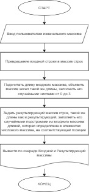

# Решение задачи контрольного среза

> *Задача*: Написать программу, которая из имеющегося массива строк формирует новый массив из строк, длина которых меньше, либо равна 3 символам. ___Первоначальный___ массив можно ввести с клавиатуры, либо задать на старте выполнения алгоритма. При решении не рекомендуется пользоваться коллекциями, **лучше обойтись исключительно массивами**.

Алгоритм решения был описан в блок-схеме:

Итак пройдёмся поподробнее:

1.  *Ввод пользователем изначального массива. Превращение входной строки в массив строк.* Здесь я опишу отдельный метод для считывания массива, разделителем будет служить запятая. 

<code>
string[] GetArray (string input)
</code>

>Базироваться будет данный метод на <code>String.Split</code>, с дополнительным *"причёсыванием"* входной строки (Проверка на лишние разделители и пробелы). 

2.  *Подсчитать длину входного массива, объявить массив чисел такой же длины, заполнить его случайными числами от 0 до 3.* Довольно, как говорят за океаном, _self-explanatory_ пункт. Суть в том, чтобы определить какой длины будет элемент результируего массива, то есть каждый элемент числового массива будет соответствовать длине элемента результируещего массива и будет использоватьсяя при извлечения подстроки с помощью <code>String.Substring</code>.

3.  *Задать результирующий массив строк, такой же длины как и результирующий, заполнить его случайными подстроками из входного массива длиной, которая определлена в элементах числового массива, на соответствующей позиции.*  Это самая занимательная часть кода. Под случайной подстрокой я имею в виду, что подстрока будет браться с рандомного символа с учётом длины нужной подстроки. 

***ВАЖНО***

> Обязательно продумать и прописать исключения, чтобы программа не ломалась. 

4. В заключение, вывод массивов. Здесь будет использоваться стандартный метод <code>PrintArray</code>.  

